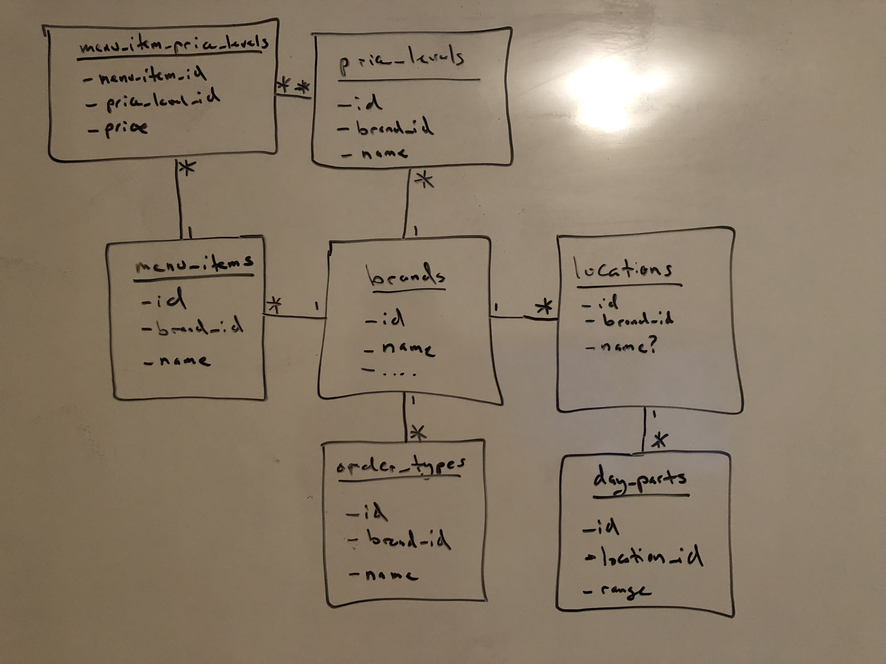

# Design

## Persistence Layer

The first part of this system involves creating a handful of relational 
database tables for each of the entities listed in the requirements. For the 
purpose of this exercise I will assume that the total dataset of these tables 
is "small" enough to fit into Postgres (if not I would start by splitting the 
tables up by `brand`, then probably moving to a different datastore). The 
easiest way to describe the relationships between the tables is visually:



As shown above, essentially every bold term given in the requirements maps to
a table in this database. The various joins correspond to 1-to-1, 1-to-many, 
etc. relationships between the entities. One assumption I've made here is that
the `order_types`, `price_levels`, and `menu_items` are unique to `brands`.

Mapping out exact column names and creating table schemas should be pretty 
straightforward (I am only skipping this due to time constraints.) Something 
would also have to be implemented in order to load/update the data. This could
either be a script processing more "raw" forms of data (.txt, .csv, etc.) 
or possibly a UI users can interact with directly.

These tables comprise what I'm calling the "persistence layer". They are 
stored in relational tables and should not be updated all too often. They will
serve as the source of truth for the "cache layer" I describe in the next 
section.

## Cache Layer

Every morning/night/decided interval the "cache layer" is created for each 
location. Using the persistence layer from above, two key-value stores are 
created for each location. These will be denormalized tables allowing for
quick lookups at the point of sale. A perfect medium for this would be Redis.
I think it is safe to say that the amount cached data needed for a given 
`location` can easily fit into Redis. The row schemas for these two tables are:

```
order_type, hour => [price_level1 (w/ day_part), price_level2 (w/o day_part)]

menu_item_id => {price_level: price}
```

The first table can be created using a combination of `brands`, `locations`,
`day_parts`, and the corresponding "price level configuration". This part was
a little vague in the description, but whatever form it is given in can be 
used to populate this first table. It is important to note here that we are 
exploding out the `day_parts` into multiple `hour` rows, ie: the example 
`location` would have "Breakfast" hours from `2` to `10` (`11` would be 
associated with "Lunch".) Using each of these (`order_type`, `hour`) pairs
(and their corresponding `day_part`) we can fill in values for the desired
`price_levels`, one that uses the `day_part` and one that doesn't. What we
are left with is a priority list of `price_levels` (size: 0 - 2 items) for
any given (`order_type`, `hour`) pair.

The second table is much more simple, it merely stores the various 
`price_levels` available for a given `menu_item` (as a dictionary).


# Use

For a given location, if the cache doesn't exist, it is created. Otherwise
it is updated on some given interval. The cache is then used to determine
the price for any given `menu_item`. First, using the `order_type` and 
current `hour`, the first cache table is queried to determine the 
corresponding `price_levels`. Then, using the `menu_item_id` we query the 
second table to see which `price_levels` are valid. We return the `price` of 
the first matching `price_level`, if there are none, then the item cannot be 
purchased.


